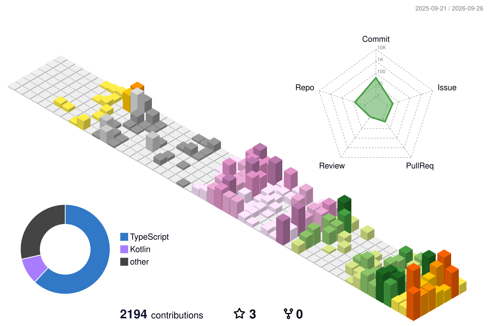

  

  
  
  
  
  
  
  
  

  
  

  

<picture>
  <source media="(prefers-color-scheme: dark)" srcset="./profile-3d-contrib/profile-night-rainbow.svg" />
  <source media="(prefers-color-scheme: light)" srcset="./profile-3d-contrib/profile-season-animate.svg" />
  
</picture>

<picture>
  <source
    media="(prefers-color-scheme: dark)"
    srcset="https://raw.githubusercontent.com/fcmNaNo2/fcmNaNo2/output/github-contribution-grid-snake-dark.svg"
  />
  <source
    media="(prefers-color-scheme: light)"
    srcset="https://raw.githubusercontent.com/fcmNaNo2/fcmNaNo2/output/github-contribution-grid-snake.svg"
  />
  
</picture>
